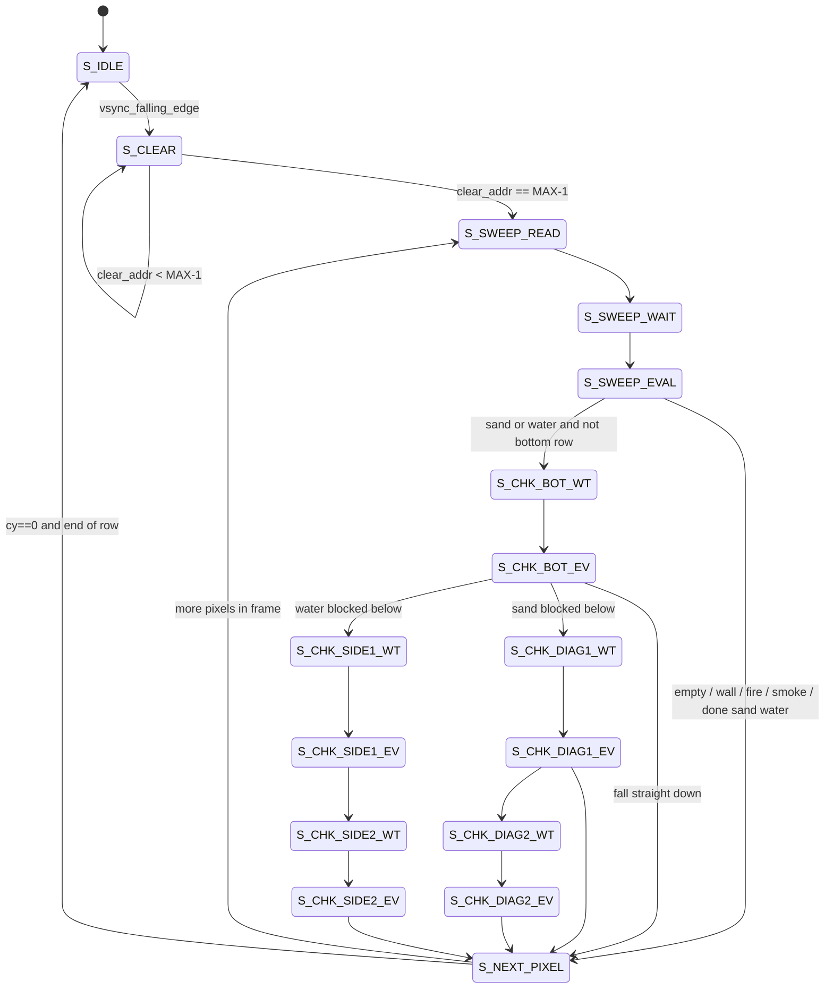

# FPGA Sandbox 项目工作流程

本文档对应当前仓库中的 **DE1-SoC 元胞自动机沙盒**：逻辑网格 `320×240`、双缓冲 M10k、HPS 通过 Lightweight HPS-to-FPGA 桥写笔刷、FPGA 侧 CA 状态机在 `M10k_pll` 时钟域跑物理与缓冲交换。

---

## 一、PIO / 外设导出一览

### 1.1 在 `DE1_SoC_Computer.v` 中已连接到 FPGA 逻辑的信号

以下端口来自 `Computer_System`（Qsys 生成），在 `verilog/DE1_SoC_Computer.v` 的 `The_System` 例化里与 FPGA 侧 wire 相连。

| Qsys / 端口名 | 类型说明 | FPGA 侧 wire | 位宽 | 作用简述 |
|----------------|----------|----------------|------|----------|
| `vga_pio_locked_export` | PLL 锁定 | `vga_pll_lock` | 1 | VGA 像素时钟 PLL 锁定指示 |
| `vga_pio_outclk0_clk` | PLL 输出时钟 | `vga_pll` | 1 | 供 `vga_driver` 的像素时钟 |
| `m10k_pll_locked_export` | PLL 锁定 | `M10k_pll_locked` | 1 | M10k/CA 时钟域 PLL 锁定 |
| `m10k_pll_outclk0_clk` | PLL 输出时钟 | `M10k_pll` | 1 | 网格 RAM 与 CA FSM 主时钟 |
| `brush_x_pio_external_connection_export` | Avalon PIO → FPGA | `brush_x` | `[9:0]` | 笔刷逻辑列坐标 `0..319` |
| `brush_y_pio_external_connection_export` | Avalon PIO → FPGA | `brush_y` | `[8:0]` | 笔刷逻辑行坐标 `0..239` |
| `brush_mat_pio_external_connection_export` | Avalon PIO → FPGA | `brush_mat` | `[3:0]` | 材质编码（与 `MAT_*` 一致） |
| `brush_we_pio_external_connection_export` | Avalon PIO → FPGA | `brush_we` | 1 | 写使能脉冲：HPS 写 1 再写 0 触发一拍写入 |
| `timer_pio_external_connection_export` | Avalon PIO → FPGA | `hw_cycle_count` | `[31:0]` | 可由 HPS 维护的计数器（本设计 CA 未强依赖） |
| `key_pio_external_connection_export` | Avalon PIO → FPGA | `hps_keys` | `[31:0]` | 供 HPS 读取的 FPGA 按键镜像（当前顶层未驱动时悬空，若需上报请在顶层 `assign`） |

> **说明**：`vga_pio` / `m10k_pll` 在 Qsys 中为 **PLL IP**，不是 `altera_avalon_pio`，但同样通过 `export` 把时钟/锁定接到 FPGA。

### 1.2 Qsys 中存在、但当前顶层 `DE1_SoC_Computer.v` 未例化连线的模块

在 `verilog/Computer_System.qsys` 中仍可看到下列 **Avalon PIO**（若你在 HPS 软件里曾用过，需注意顶层是否已接线）：

| Qsys 模块名 | 典型用途 |
|-------------|----------|
| `start_pio` | 启动/握手类控制（当前顶层未连接） |
| `done_pio` | 完成标志（当前顶层未连接） |

若需使用，应在 `DE1_SoC_Computer.v` 增加对应 `wire` 并接到 `The_System` 端口。

### 1.3 HPS 侧访问笔刷 PIO 的偏移（与 `hps_control.c` 一致）

| 符号 | 相对 `0xFF200000` 的偏移 | 说明 |
|------|--------------------------|------|
| `BRUSH_WE_OFFSET` | `0x00` | 写使能 |
| `BRUSH_MAT_OFFSET` | `0x10` | 材质 |
| `BRUSH_Y_OFFSET` | `0x20` | Y |
| `BRUSH_X_OFFSET` | `0x30` | X |

基址与跨度见 `hps_control.c`：`HW_REGS_BASE`、`HW_REGS_SPAN`。

---

## 二、CA 物理引擎 FSM 工作流程

### 2.1 总体节拍（每帧）

在 **`M10k_pll`** 时钟域运行；以 **VGA 场同步 `VGA_VS` 的下降沿** 作为“一帧结束、可交换缓冲”的同步点。

1. **`S_IDLE`**  
   等待 `vsync_falling_edge`。到来后 **翻转 `active_buffer`**（前台/后台交换），进入清屏。

2. **`S_CLEAR`**  
   从地址 `0` 到 `MAX_CELLS-1`，对 **新的后台** 整幅写入 `MAT_EMPTY`（为后续“只写非空粒子”做准备）。

3. **扫描整幅（从下到上）**  
   - **`S_SWEEP_READ`**：对当前 `(cx, cy)` 发出读 **前台** 地址 `ca_read_addr = cy * GRID_WIDTH + cx`。  
   - **`S_SWEEP_WAIT`**：等待 M10k 读延迟一拍。  
   - **`S_SWEEP_EVAL`**：根据读到的 `ca_read_data`（材质）分支：空则跳过；墙/火/烟原地写回；沙/水可能进入下落或扩展子状态机。

4. **沙 / 水的子序列**（按需进入）  
   - **`S_CHK_BOT_*`**：读正下方 `(cx, cy+1)`，决定竖直下落。  
   - **`S_CHK_DIAG1_*` / `S_CHK_DIAG2_*`**：沙在下方被挡时尝试对角滑移。  
   - **`S_CHK_SIDE1_*` / `S_CHK_SIDE2_*`**：水在下方被挡时横向扩散（含 `water_moving` 两拍写邻格逻辑）。

5. **`S_NEXT_PIXEL`**  
   `cx` 自增扫一行；行尾 `cx` 回零且 `cy` 减 1，直到 `cy==0` 扫完，回到 **`S_IDLE`** 等下一帧 VSYNC。

### 2.2 状态转移示意（Mermaid）

### 2.3 与双缓冲的关系（概念）

- **`active_buffer`**：`0` 时缓冲 A 为 **前台**（VGA 读 A 口、`ca_read_data` 读 A 口 B 输出），B 为 **后台**（CA 写 B）；`1` 时角色对调。  
- **HPS 笔刷**：`brush_we` 有效时，写地址/数据复用到 **当前后台** 的 Port B（与 CA 写 MUX 见 `we_comb` / `addr_comb` / `data_comb`）。

---

## 三、FSM 重要信号说明

| 信号名 | 类型 | 含义 |
|--------|------|------|
| `state` | `reg [3:0]` | 当前 FSM 状态（`S_IDLE` … `S_NEXT_PIXEL`） |
| `M10k_pll` | `wire` | CA / M10k 时钟 |
| `sys_reset_n` | `wire` | `KEY[0]` 高有效异步复位（与 `vga_reset` 相反） |
| `active_buffer` | `reg` | 双缓冲前台选择 |
| `VGA_VS` | `input` | VGA 场同步（用于帧边界） |
| `prev_vsync` | `reg` | 上一拍 `VGA_VS`，用于边沿检测 |
| `vsync_falling_edge` | `wire` | `prev_vsync==1 && VGA_VS==0`，触发缓冲交换与进入 `S_CLEAR` |
| `clear_addr` | `reg [16:0]` | 清屏写地址计数 |
| `cx`, `cy` | `reg [9:0]` | 当前扫描格坐标（逻辑宽 `GRID_WIDTH`，高 `GRID_HEIGHT`） |
| `ca_read_addr` | `reg [16:0]` | 发给 M10k Port B 的读地址（读 **前台** 当前状态） |
| `ca_read_data` | `wire [3:0]` | 前台读出的材质 |
| `ca_we` | `reg` | CA 对后台写使能（每拍默认拉低，各状态按需拉高） |
| `ca_write_addr` | `reg [16:0]` | 后台写地址 |
| `ca_write_data` | `reg [3:0]` | 后台写入材质 |
| `current_mat` | `reg [3:0]` | 在 `S_SWEEP_EVAL` 锁存的当前格材质，供下落/扩散子状态使用 |
| `random_bit` / `lfsr` | `wire` / `reg [15:0]` | 沙对角优先方向、水左右优先方向的伪随机位 |
| `diag_side` | `reg` | 每像素采样 `random_bit` 后的侧向/对角优先选择 |
| `water_moving` | `reg` | 水横向扩散：是否已决定把自身置空并在下一拍写邻格 |
| `water_target_addr` | `reg [16:0]` | 水要写入的邻格地址 |
| `brush_we` / `brush_x` / `brush_y` / `brush_mat` | `wire` | HPS 笔刷：写使能与坐标、材质 |
| `we_comb` / `addr_comb` / `data_comb` | `wire` | 笔刷优先于 CA 的写 MUX |
| `GRID_WIDTH` / `GRID_HEIGHT` / `MAX_CELLS` | `parameter` | 网格尺寸与总格数 |
| `MAT_*` | `parameter` | 材质编码：`EMPTY=0, SAND=1, WATER=2, WALL=3, FIRE=4, SMOKE=5` |

---

## 附录：材质与显示

- 物理与颜色映射见 `verilog/DE1_SoC_Computer.v` 中 `MAT_*` 与 `final_vga_color` 的 `case`。  
- 鼠标笔刷方块边长由 **`hps_control.c` 的 `BRUSH_SIZE`** 决定，与材质无关。

文档版本：与仓库内 `verilog/DE1_SoC_Computer.v`、`hps_control.c` 当前结构一致。
